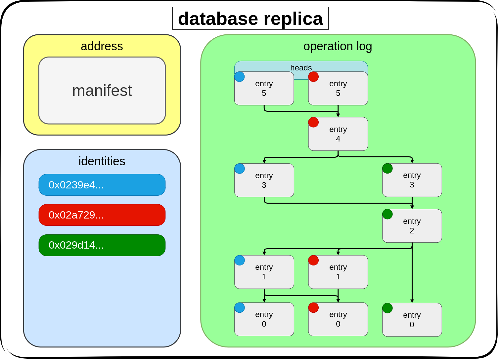
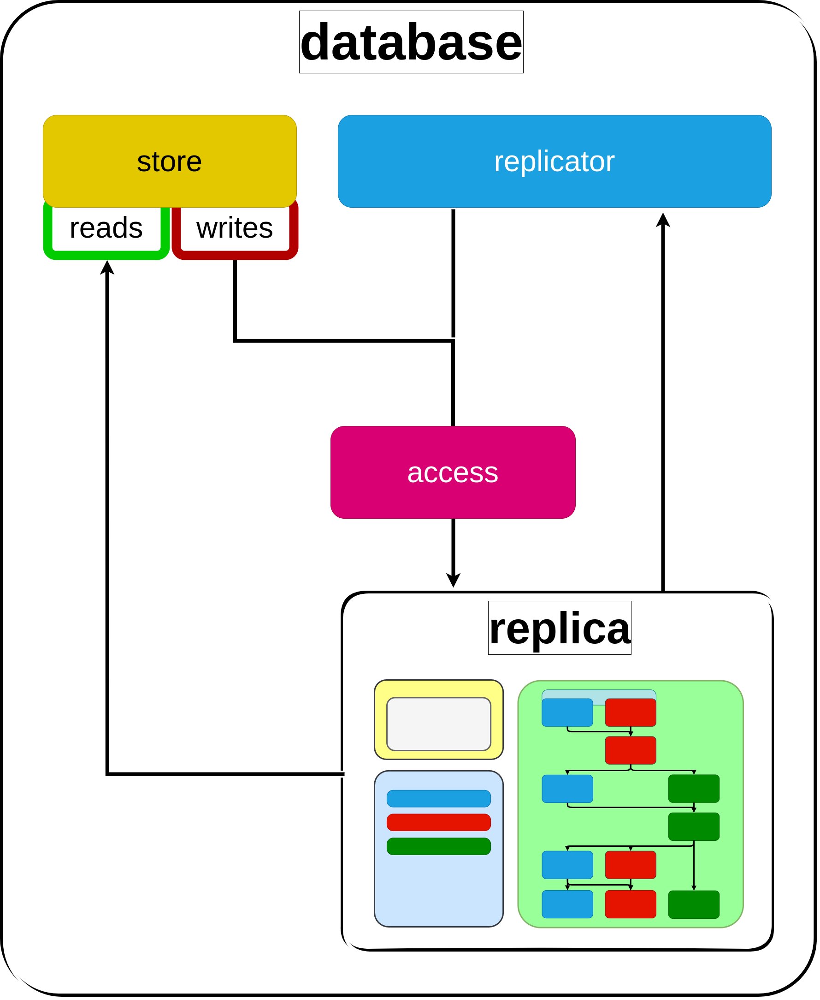

# 

# Protocol Overview

-----

**Abstract**

OrbitDB is a peer-to-peer database. It makes use of [CRDTs](https://en.wikipedia.org/wiki/Conflict-free_replicated_data_type) which guarantee [strong eventual consistency](https://en.wikipedia.org/wiki/Eventual_consistency#Strong_eventual_consistency) and conflict-free database merges. It's well suited for use in [local-first](https://www.inkandswitch.com/local-first/) software applications.

# Table of Contents

- [Introduction](#introduction)
- [Replica](#replica)
- [Processes](#processes)
- [The CRDTS](#the-crdts)
- [Fundamental Limits](#fundamental-limits)
- [Design in Use](#design-in-use)

## Introduction

The OrbitDB protocol defines ways to create and participate in a shared, mutable state with other peers. Each peer maintains its own copy of the database called a replica.
Instead of reading from a remote database, the peer's local database replica is used as the source of truth.

A participant can read and write to the database while offline. Updates they made while disconnected from peers can be communicated later in a conflict-free way. Peers with the same set of updates will have the same database state.

## Replica

The replica is made up of data which is later processed into the database state. It is also the part of the database that gets passed between peers. There are three data formats that make up the database replica: the manifest, entry, and identity.

The [manifest](./MANIFEST.md) is a setup document. It contains configuration for the database. Nodes that setup their database with the manifest configuration will satisfy strong eventual consistency; no additional agreement or coordination is required. The hash of the manifest is the database "address".

The [entry](./entry) is a CRDT with a payload. Each entry is a DAG node with causal links to previous entries. They make up the immutable log of updates to the database store.

The [identity](./identity) contains a signed public key. Each entry has an identity associated with it for verification of the entry signature and access control.

A database replica is made up of a manifest, and sets of entry and identity.

## Processes

The database process the replica by a few different components: 

 - [store](./store) provides the interface to read and write to the database.

 - [access](./access) provides access control/write protection to the database, enforced by peers on their own replica.

 - [replicator](./replicator) handles syncing the replica across participating devices.

## The CRDTs

The CRDTs being used are best described as [Merkle-CRDTs](https://research.protocol.ai/publications/merkle-crdts-merkle-dags-meet-crdts/). That is the combination of CRDTs with Merkle-DAGs. This gives some nice properties to the CRDTs, two being causal links and deduplication. Since the causal links are part of the data and any entry can be merged without conflict, the network does not need to worry about delivery order.

## Fundamental Limits

Do not try to build a cryptocurrency with OrbitDB (unless you really, really want to). There are somethings you cannot do with OrbitDB and similar peer-to-peer databases.These limits are explained in [Byzantine Eventual Consistency and the Fundamental Limits of Peer-to-Peer Databases](https://martin.kleppmann.com/2021/10/07/consensusdays.html). With OrbitDB we allow concurrent and async updates to occur and be merged. This is great for use in some applications, but for others with invariants like *no negative numbers* this isn't doable.

## Design in Use

Designing applications with OrbitDB can feel very different. Understanding it's differences and a few tricks will result in a better design. One of the biggest differences is that there is no idea of a global and consistent state in OrbitDB, peers replicas are allowed to diverge and converge over and over. Another thing devs might find very different is that the database is local and can be read quickly and without network interruption.

It's best to split up databases (per user or even further) instead of having one for everyone, this is sometimes called partitioning. If you have a database where some or all writers will never build upon others updates you should partition that database.

The more databases that can exist in your application bring a problem. How are they found? You could hardcode them but in a lot of situations there are too many. You could also have one database that tracks all the others, but for most situations that's not the best either.
A third option is for your application to know the scheme in which the manifests are created. If you are able to determine the manifest data from knowing things like what the database is used for and/or who owns it, then you have the manifest and can open any database when needed.

----

If you would like to talk design or ask a question join our [communtiy chat](https://app.element.io/#/room/#orbit-db:matrix.org)!
